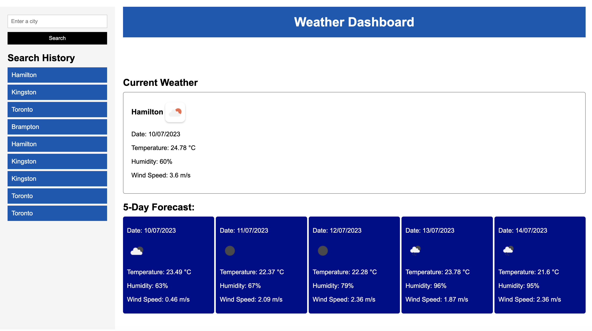

# weather_forecast

## This Week's Task
My task is to build a weather dashboard using the OpenWeather API that will run in the browser and feature dynamically updated HTML and CSS.

## User Story

User should be able to into city and get current weather forecast and a 5 days forecast for the inputted city.

## Acceptance Criteria

GIVEN a weather dashboard with form inputs
WHEN I search for a city
THEN I am presented with current and future conditions for that city and that city is added to the search history
WHEN I view current weather conditions for that city
THEN I am presented with the city name, the date, an icon representation of weather conditions, the temperature, the humidity, and the the wind speed
WHEN I view future weather conditions for that city
THEN I am presented with a 5-day forecast that displays the date, an icon representation of weather conditions, the temperature, the wind speed, and the humidity
WHEN I click on a city in the search history
THEN I am again presented with current and future conditions for that city

## Mock-up
The following image shows the web application's appearance and functionality:

## Live Link

https://mohanbeckford.github.io/weather_forecast/